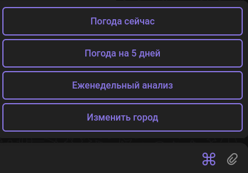
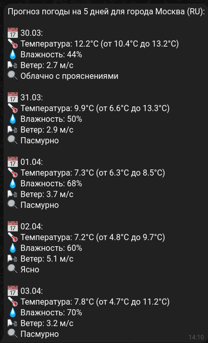
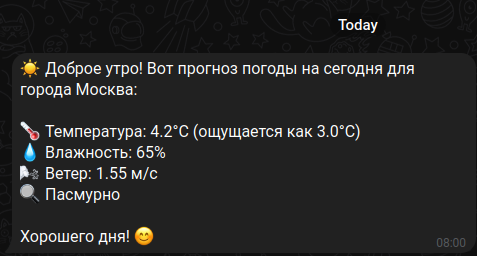
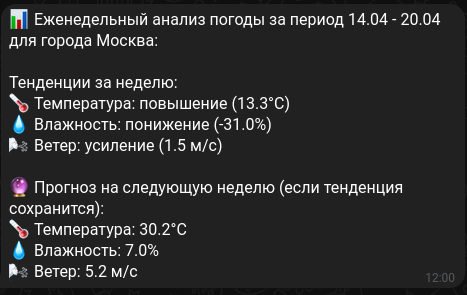
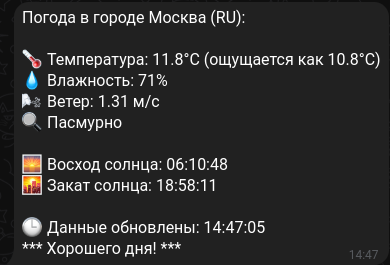

# ☁️ SkyVellum — Ваш персональный метеоролог

[](https://github.com/Wlwool/SkyVellum/actions/workflows/ci.yml)

SkyVellum — погодный бот, который следит за погодой за вас: текущие данные,
прогноз на 5 дней и еженедельный отчёт с тенденциями. 
Получайте актуальные данные, прогнозы и аналитические отчёты прямо в Telegram.



## 🌟 Функциональность

- Регистрация с выбором города
- Получение текущей погоды через команду бота
- Еженедельный анализ: тенденции за прошедшую неделю (температура, влажность,
  ветер) и прогноз на ближайшие 5 дней
- Автоматическая утренняя рассылка погоды (08:00)
- Еженедельный отчёт по воскресеньям (12:00)
- Команда `/stats` для администраторов: количество активных пользователей и список городов



## ⚙️ Технические особенности

- **Язык:** Python 3.13
- **Бот:** aiogram 3, FSM для регистрации, polling
- **Данные о погоде:** OpenWeather API (aiohttp)
- **БД:** SQLite, SQLAlchemy 2.0 (async, aiosqlite), миграции alembic
- **Планировщик:** APScheduler для рассылок
- **Логирование:** ротация логов (10 МБ × 5 файлов)
- **Зависимости:** uv
- **Инструменты:** ruff, mypy, pytest
- **Контейнеризация:** Docker Compose

## 🛠️ Запуск бота 

1. Создать `.env` файл по образцу `.env-example`: токены Telegram и OpenWeatherMap, ID админа.
2. Запуск бота через Docker:
```sh
   docker compose up --build  
   docker compose up -d  
```
Миграции БД применяются автоматически при старте контейнера.

3. Управление контейнером:
```sh
   docker compose logs -f bot  # Просмотр логов
   docker compose down  # Остановка контейнера
   docker compose restart bot  # Перезапуск
   docker exec -it skyvellum_bot /bin/bash  # Вход в контейнер
```

### Локальный запуск (через uv)

В `.env-example` путь к БД указан для Docker (`/app/database/...`). Для локального
запуска укажите в `.env` относительный путь:

```sh
DB_URL=sqlite+aiosqlite:///database/weather_bot.db
```

```sh
mkdir -p database logs
uv sync
uv run alembic upgrade head
uv run python main.py
```

## Разработка

```sh
uv run ruff check .            # линтер
uv run ruff format .           # форматирование
uv run mypy                    # проверка типов
uv run pytest                  # тесты
uv run alembic revision --autogenerate -m "описание"  # новая миграция
```

## База данных

- **users** — пользователи и их города
- **weather_data** — исторические данные для аналитики

## ⚙️ Примеры работы

### Утренний прогноз


### Еженедельный отчёт


### Текущая погода


## Обратная связь

Есть идеи или вопросы? Открывайте issue или pull request в
[репозитории](https://github.com/Wlwool/SkyVellum).
